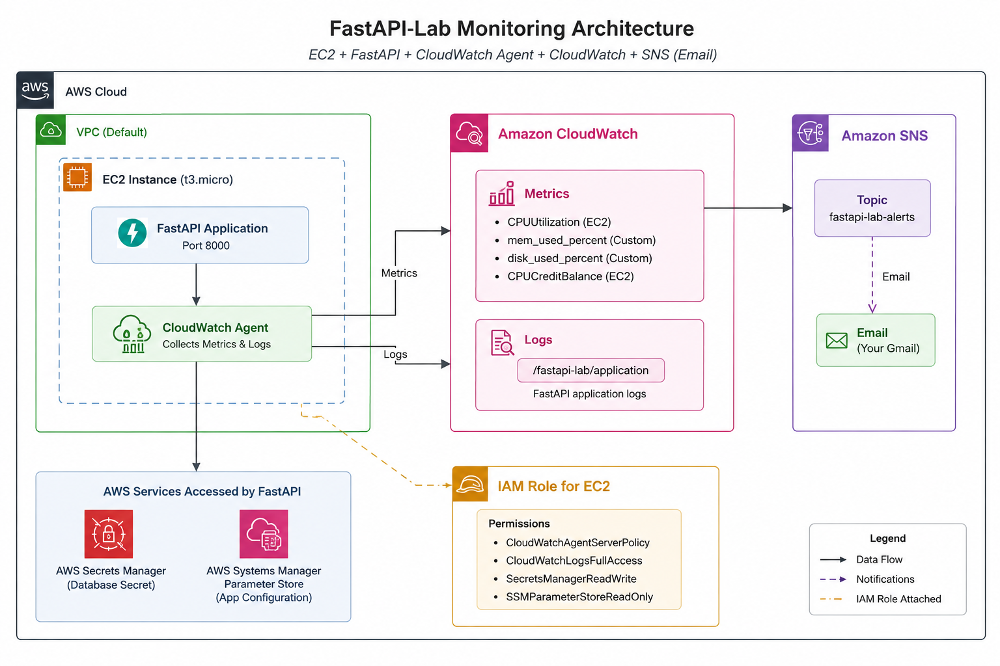
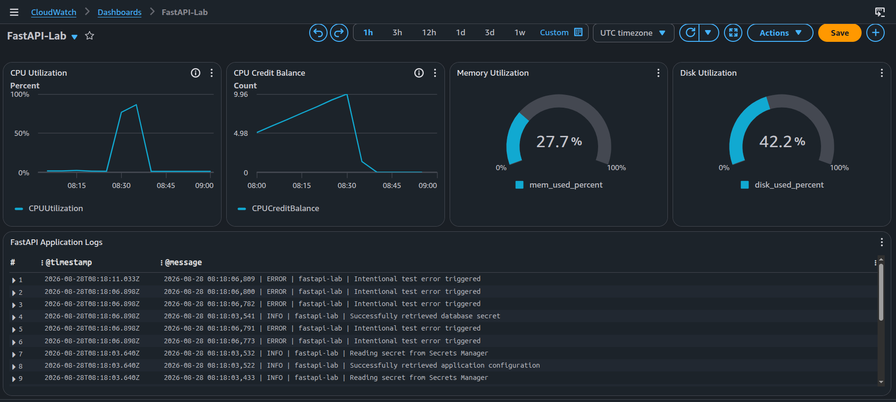
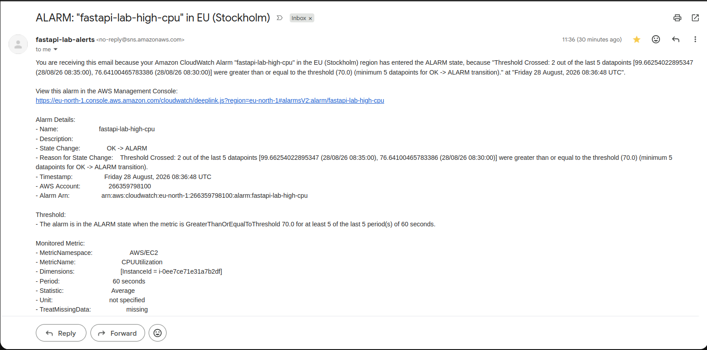

# AWS FastAPI Observability & Secrets Management Lab

## Overview

A hands-on AWS lab demonstrating how to deploy a lightweight FastAPI application on an EC2 instance and integrate it with core AWS security, configuration, observability, and alerting services.

The project focuses on securely retrieving application configuration and secrets without embedding credentials in the application, collecting EC2 and application telemetry with the CloudWatch Agent, visualizing operational data through a CloudWatch dashboard, and sending infrastructure alerts through Amazon SNS.

### Architecture

```text
                         AWS VPC
                            │
                    ┌───────┴────────┐
                    │  Public Subnet │
                    │                │
                    │  EC2 t3.micro  │
                    │  Ubuntu 26.04  │
                    │                │
                    │  FastAPI       │
                    │     │          │
                    │     │ boto3    │
                    │     ├──────────────► AWS Secrets Manager
                    │     │          │       └─ Database credentials
                    │     │          │
                    │     └──────────────► SSM Parameter Store
                    │                │       └─ Application configuration
                    │                │
                    │  CloudWatch    │
                    │  Agent         │
                    │     │          │
                    └─────┼──────────┘
                          │
                          ▼
                    Amazon CloudWatch
                    ├── Metrics
                    ├── Logs
                    ├── Logs Insights
                    ├── Dashboard
                    └── Alarms
                          │
                          ▼
                    Amazon SNS
                          │
                          ▼
                       Email
```

> Replace the diagram above with the project's draw.io architecture diagram if preferred.

### Architecture Diagram



---

## AWS Services

| Service | Purpose |
|---|---|
| **Amazon EC2** | Hosts the FastAPI application |
| **AWS IAM** | Provides the EC2 workload with controlled AWS permissions |
| **AWS Secrets Manager** | Stores sensitive application secrets |
| **SSM Parameter Store** | Stores application configuration |
| **Amazon CloudWatch** | Metrics, logs, dashboards, Logs Insights, and alarms |
| **CloudWatch Agent** | Collects OS-level metrics and application log files |
| **Amazon SNS** | Delivers CloudWatch alarm notifications by email |

---

# Implementation

## 1. EC2 Instance

An Ubuntu Server 26.04 EC2 `t3.micro` instance was launched in an existing public subnet.

The instance was associated with an IAM role containing the permissions required by the application and CloudWatch Agent.

The application was installed under:

```text
/opt/app
```

A Python virtual environment was created at:

```text
/opt/app/venv
```

The EC2 user-data script is included in:

```text
userdata.txt
```

---

## 2. FastAPI Application

The application is intentionally small and exists primarily to provide a realistic workload for the AWS integrations.

Dependencies:

```text
fastapi
uvicorn
boto3
```

The application:

- Reads configuration from Parameter Store.
- Reads a database secret from Secrets Manager.
- Writes application logs to:

```text
/var/log/fastapi/app.log
```

- Provides endpoints for health checks, configuration testing, secret retrieval testing, errors, and slow requests.

The complete application is included in:

```text
main.py
```

---

## 3. AWS Secrets Manager

A Secrets Manager secret was created with the name:

```text
fastapi-lab/database
```

Example secret structure:

```json
{
  "username": "admin",
  "password": "super-secret-password"
}
```

The FastAPI application retrieves it using:

```python
secrets_client.get_secret_value(
    SecretId="fastapi-lab/database"
)
```

The password is never returned by the API.

The application only reports whether the secret was successfully loaded.

---

## 4. SSM Parameter Store

The following application parameters were created:

```text
/fastapi-lab/environment
/fastapi-lab/api_version
/fastapi-lab/log_level
```

Example values:

```text
environment → production
api_version → v1
log_level   → INFO
```

The application retrieves them using the AWS SDK for Python (`boto3`).

This demonstrates the separation between:

```text
Secrets Manager
→ Sensitive information

Parameter Store
→ Application configuration
```

---

## 5. IAM

The EC2 instance uses an IAM role rather than static AWS credentials.

The role grants the application access to the required AWS resources, including:

```text
secretsmanager:GetSecretValue
ssm:GetParameter
```

The CloudWatch Agent also uses the EC2 instance role to publish metrics and logs.

This avoids storing AWS access keys on the EC2 instance.

---

## 6. CloudWatch Agent

The CloudWatch Agent was installed on the EC2 instance and configured using:

```text
amazon-cloudwatch-agent.json
```

The configuration collects:

```text
CPU
Memory
Disk usage
```

and sends them to the custom CloudWatch namespace:

```text
FastAPI-Lab/EC2
```

The agent also collects:

```text
/var/log/fastapi/app.log
```

and sends it to:

```text
/fastapi-lab/application
```

The installation and configuration commands are documented in:

```text
cloudwatch-agent-install.txt
```

---

## 7. CloudWatch Dashboard

A CloudWatch dashboard named:

```text
FastAPI-Lab
```

was created to provide a centralized view of the application host and its operational state.

The dashboard contains infrastructure metrics and the FastAPI application logs.

### Dashboard



---

## 8. CloudWatch Logs Insights

CloudWatch Logs Insights was used to investigate application logs.

Example query:

```text
fields @timestamp, @message
| filter @message like /ERROR/
| sort @timestamp desc
| limit 20
```

This makes it possible to quickly locate application errors without logging into the EC2 instance and reading the local log file.

---

## 9. CloudWatch Alarm + SNS

A CloudWatch alarm was created for EC2 CPU utilization.

The alarm configuration used:

```text
Metric:       EC2 CPUUtilization
Condition:    >= 70%
Evaluation:   5 consecutive 1-minute periods
```

The alarm publishes notifications to an SNS topic:

```text
fastapi-lab-alerts
```

An email subscription was then confirmed.

### CPU Alarm Email



---

# Testing the Application

Start the application on the EC2 instance:

```bash
cd /opt/app

/opt/app/venv/bin/uvicorn main:app \
    --host 0.0.0.0 \
    --port 8000
```

The API is then available at:

```text
http://<EC2_PUBLIC_IP>:8000
```

## Endpoints

### Root

```text
GET /
```

Tests that FastAPI is running.

```bash
curl http://localhost:8000/
```

Expected:

```json
{
  "message": "FastAPI AWS lab is running"
}
```

---

### Health Check

```text
GET /health
```

```bash
curl http://localhost:8000/health
```

Expected:

```json
{
  "status": "healthy"
}
```

---

### Parameter Store

```text
GET /config
```

```bash
curl http://localhost:8000/config
```

Expected:

```json
{
  "environment": "production",
  "api_version": "v1",
  "log_level": "INFO"
}
```

This verifies that FastAPI can retrieve configuration from SSM Parameter Store through the EC2 IAM role.

---

### Secrets Manager

```text
GET /secret-status
```

```bash
curl http://localhost:8000/secret-status
```

Expected:

```json
{
  "secret_loaded": true,
  "username": "admin",
  "password_loaded": true
}
```

The actual password is intentionally never returned.

---

### Generate an Application Error

```text
GET /error
```

```bash
curl http://localhost:8000/error
```

This intentionally generates an HTTP 500 error and writes an `ERROR` log entry.

The resulting log can be viewed through CloudWatch Logs and queried with Logs Insights.

---

### Generate a Slow Request

```text
GET /slow
```

```bash
curl http://localhost:8000/slow
```

The endpoint intentionally waits approximately five seconds.

This provides a simple workload for testing application behavior and logs.

---

# CPU Alarm Test

Install `stress-ng` if necessary:

```bash
sudo apt-get update
sudo apt-get install -y stress-ng
```

Generate CPU load:

```bash
stress-ng --cpu 2 --timeout 8m
```

The expected flow is:

```text
CPU load increases
        ↓
CloudWatch observes CPUUtilization
        ↓
CPU remains >= 70%
for the configured evaluation period
        ↓
CloudWatch Alarm
        ↓
SNS
        ↓
Email notification
```

After the stress test ends, CPU utilization should return to normal and the alarm can transition back to `OK` after CloudWatch evaluation.
